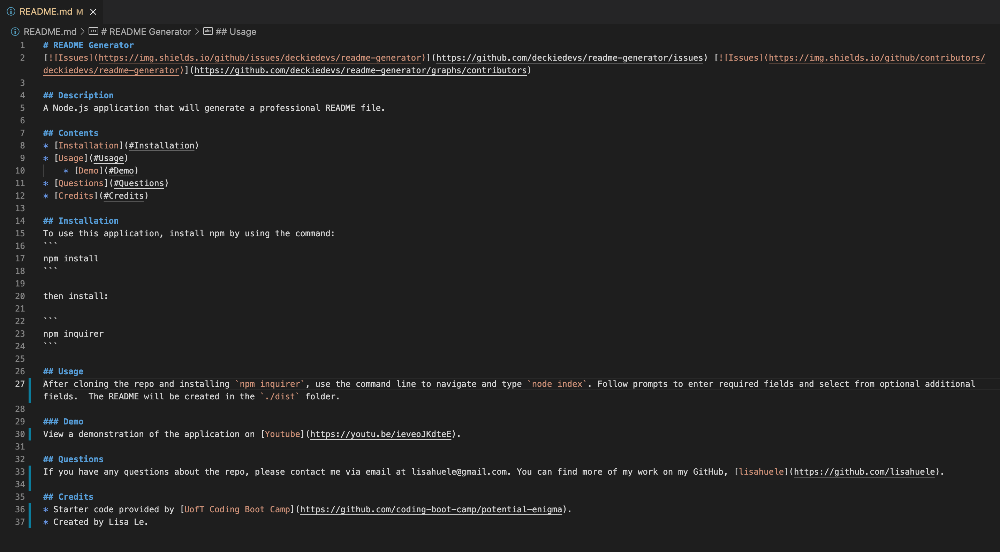

# README Generator
 
  
## Description
A Node.js application that will generate a professional README file.
    
## Contents
* [Installation](#Installation)
* [Usage](#Usage)
* [Demo](#Demo)
* [Questions](#Questions)
* [Credits](#Credits)

## Installation
To use this application, install npm by using the command: 
```
npm install
```

then install:

```
npm inquirer
```

## Usage
After cloning the repo and installing `npm inquirer`, use the command line to navigate and type `node index`. Follow prompts to enter required fields and select from optional additional fields.  The README will be created in the `./dist` folder. 

### Demo
View a demonstration of the application on [Youtube](https://youtu.be/ieveoJKdteE).
    
## Questions
If you have any questions about the repo, please contact me via email at lisahuele@gmail.com. You can find more of my work on my GitHub, [lisahuele](https://github.com/lisahuele).

## Credits
* Starter code provided by [UofT Coding Boot Camp](https://github.com/coding-boot-camp/potential-enigma).
* Created by Lisa Le.